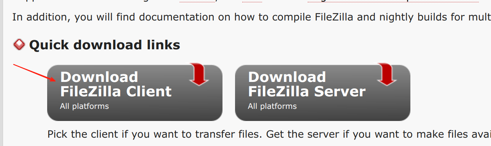
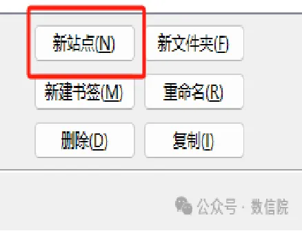
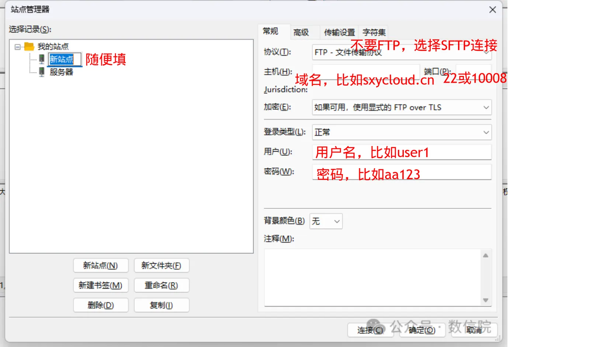
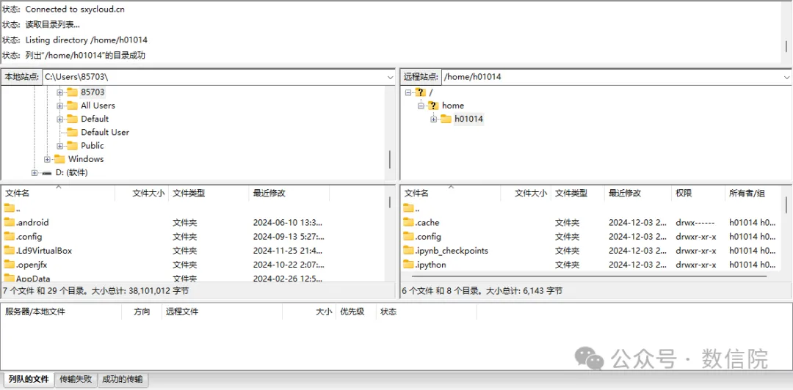

## Filezilla软件(Linux/Win/MAC)

**1.安装软件**

从官网下载相应的版本，然后进行安装

官网链接：https://filezilla-project.org/

**2.新建站点**

左上角点击，进行新建站点

**3.填写服务器信息**

示例信息：

用户名：user_test1

主机：sxycloud.cn

端口：10008

密码：XXX

[注意：此处只是示例信息，请基于管理员给你的账号信息进行相应信息的替换！]{style="color: red"}

**4.成功连接的界面**

[注意：左边栏是你的本地电脑文件目录，右边栏是你的云服务器文件目录！]{style="color: red"}

