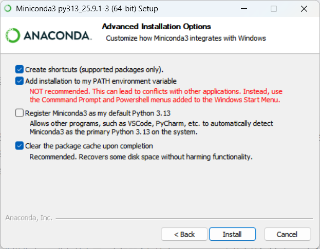

-   首先下载miniconda安装包，https://www.anaconda.com/download/success
-   安装过程中选择



-   然后在终端中输入conda init，bash可以使用conda init bash，重启终端之后默认就会激活base环境了

```         
# 1. 先添加 bioconda
conda config --add channels bioconda

# 2. 再添加 conda-forge (后添加的优先级更高)
conda config --add channels conda-forge

conda config --show channels
```