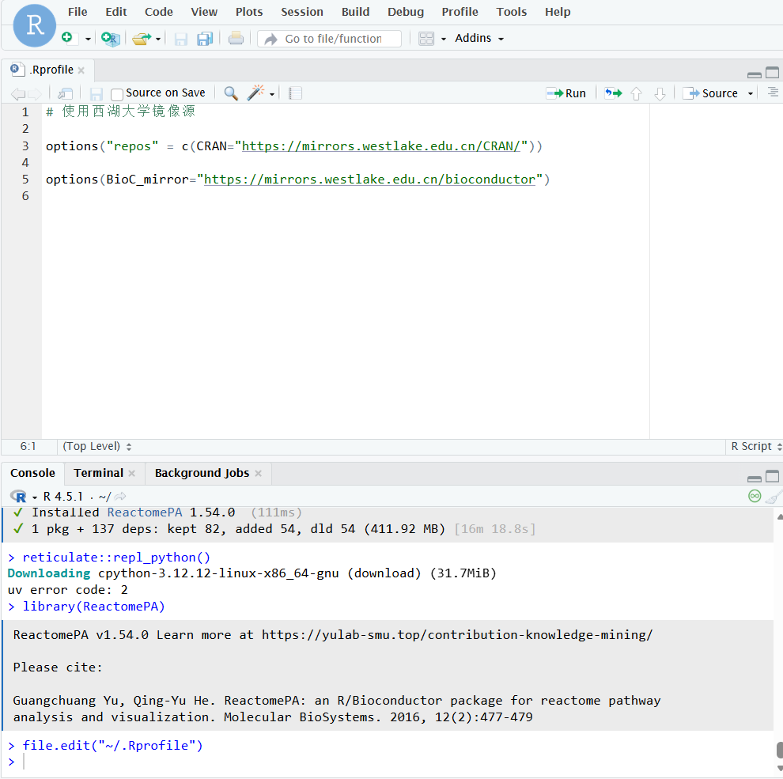

**临时配置镜像**

```{r}
# 使用西湖大学镜像源

options("repos" = c(CRAN="https://mirrors.westlake.edu.cn/CRAN/"))

options(BioC_mirror="https://mirrors.westlake.edu.cn/bioconductor")

```

**永久配置镜像**

```{r}
file.edit("~/.Rprofile") # 编辑.Rprofile文件，不存在则创建
```

然后把镜像配置写入文件



退出重进，测试配置是否生效

```{r}
options("repos")
# $repos                                  CRAN 
#"https://mirrors.westlake.edu.cn/CRAN/" 

options("BioC_mirror")
# $BioC_mirror
# [1] "https://mirrors.westlake.edu.cn/bioconductor"
```