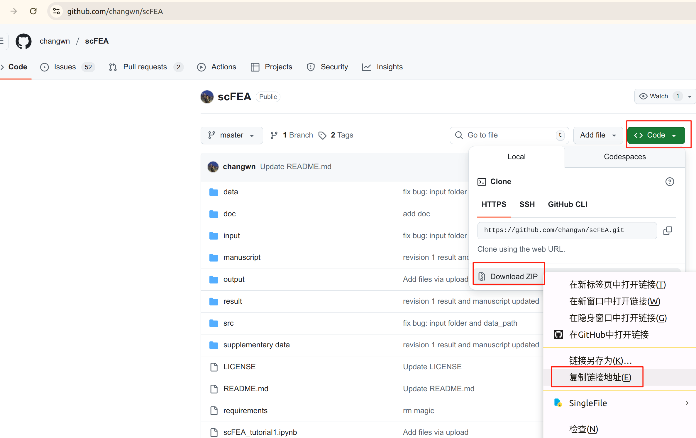

## github镜像加速

在安装R包或者使用conda进行环境配置和软件安装过程中，经常会碰到下载缓慢和失败的情况！

使用git clone等命令从github中进行软件安装也会遇到类似情况，所以使用github镜像加速下载是十分有必要的，可以方便大家快速安装软件和包！

### 1.通过git clone下载github包

原始命令为：`git clone https://github.com/stilleshan/dockerfiles`

只需要在`git clone`和`https://github.com/stilleshan/dockerfiles` 中间添加镜像地址 `https://ghfast.top/`即可

加速的完整命令：`git clone https://ghfast.top/https://github.com/stilleshan/dockerfiles`

### 2.通过wget & curl下载github包

有时候`git clone`无法正常使用，那么还有一种办法就是直接下载github包的zip文件，使用`wget`和`curl`命令进行内容下载

首先登录要下载的github包的网站，然后1.点击`Code`，2.右键点击`Download ZIP`，3.点击`复制连接地址`，就可以得到完整的下载地址了

接下来开始使用`wget`和`curl`命令进行内容下载！

原始命令为：

`wget https://github.com/changwn/scFEA/archive/master.zip`

`curl -O https://github.com/changwn/scFEA/archive/master.zip`

同样，只需要在wget (curl) 与 https://github.com/changwn/scFEA/archive/master.zip 之间添加镜像地址 `https://ghfast.top/` 即可

加速的完整命令：

`wget https://ghfast.top/https://github.com/changwn/scFEA/archive/master.zip`