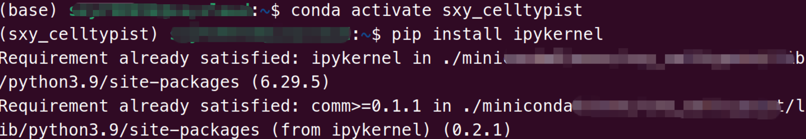
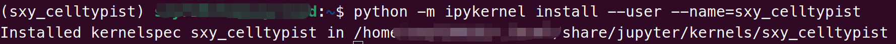
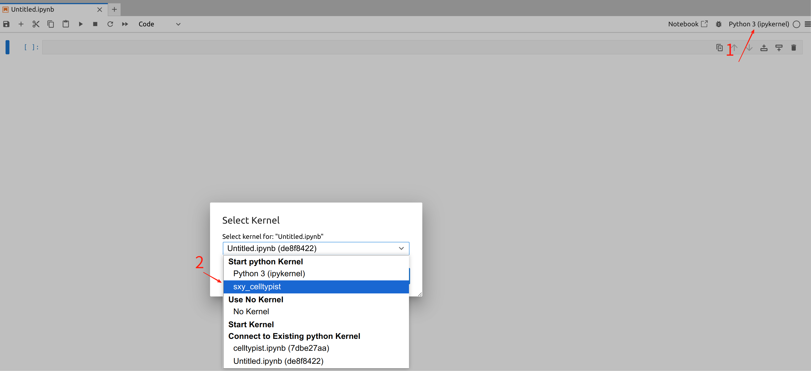

## Jupyter使用指定的conda环境

> \[!NOTE\]
>
> 当你在jupyterhub里创建了一个新的ipynb脚本时，如何使用指定的conda环境？

我们以conda环境`sxy_celltypist`为例

**1.在指定的conda环境里安装依赖**



在终端执行以下命令，替换为你想要使用的conda环境

```         
# 激活对应环境
conda activate 环境名
# 安装ipykernel包
pip install ipykernel
```

**2.将conda环境连接入Jupyter**



在终端执行以下命令，替换为你想要使用的conda环境

```         
python -m ipykernel install --user --name=环境名
```

**3.回到Jupyter创建指定conda环境的ipynb文件**

按照红色箭头的指引，首先点击1.(ipykernel)，然后选择2.(sxy_celltypist)，那么就成功开始使用`sxy_celltypist`作为ipynb的环境了！

