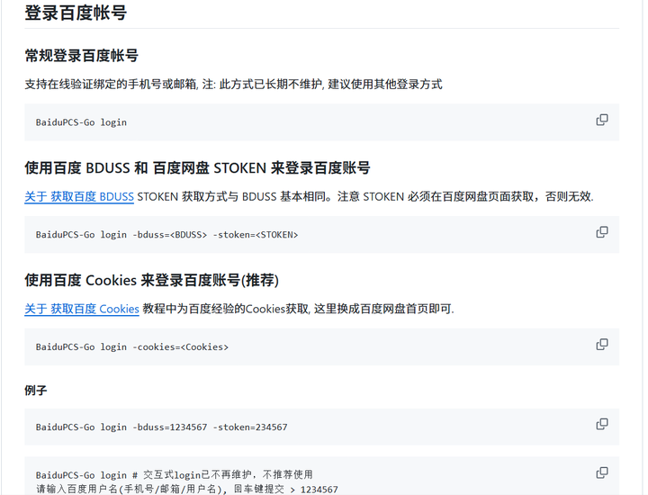
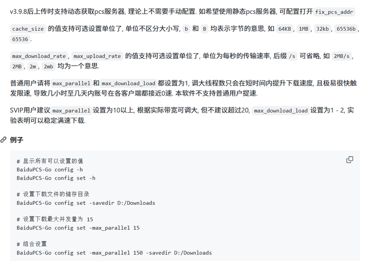

项目地址如下，详细使用方法在其中

[BaiduPCS-GO](https://github.com/qjfoidnh/BaiduPCS-Go)

软件已经下载好了，不需要大家下载，直接登录即可

```{bash}
# 测试软件是否可用，返回帮助文档说明可用
BaiduPCS-Go -h
```

## **登录**

下面是官方文档的介绍，我这里使用官方推荐的Cookies来进行登录



首先在浏览器中登录百度网盘


按F12键,浏览器会弹出如下窗体,然后点击Network一栏,有些浏览器是中文的:网络

（按F12没反应的话，先按Fn，再按F12试试）


按F5键,然后再如图框中滚到最上面


找到下图的这个名称（可能是main或者其他），总之链接含有是pan.baidu.com，左键点击，出现如下界面，向下滚动可以找到Cookies，复制，cookie的复制要从BAIDUID开始一直到最后,头尾不要多空格


复制完之后使用如下示例代码进行登录，cookies更换为自己的即可，注意两侧加上引号

```         
BaiduPCS-Go login -cookies="BAIDUID=50949C0890YG9735EA6Q3870AFE38:FG=1; BIDUPSID=112335C0ACCAFFJW675EA69A870AFE38; PSTM=1981928511; BDORZ=D6745EBF6F3SW24E515D22A1598; PANWEB=1; BDUSS=ASAYUGFHSTFKGBGSU; STOKEN=gfsdge9gisfgspig34254d7879eee5756b10sgeyrw5vyw342td510ffc2251; SCRC=cwrywec5evyetra26bvvehefvfg6a8; BDCLND=C%4sfgGysrZ%2BML6; PANPSC=wreyewygdfhdggedhsdfg4353"  

BaiduPCS-Go logout # 退出
```

## **使用**

首先进行配置

```         
# 显示配置 
BaiduPCS-Go config 

# 设置配置  
BaiduPCS-Go config set -max_parallel 15 -savedir ~/Downloads
```

参照如下官方文档的推荐进行设置



# 常用命令

```         
# 显示网盘空间使用情况 
BaiduPCS-Go quota  

# 切换工作目录 
BaiduPCS-Go cd <目录>  

# 列出文件 
BaiduPCS-Go ls  

# 下载 
BaiduPCS-Go download <网盘文件或目录的路径1> <文件或目录2> <文件或目录3> ... 
BaiduPCS-Go d <网盘文件或目录的路径1> <文件或目录2> <文件或目录3> ...  

# 上传 

BaiduPCS-Go upload <本地文件/目录的路径1> <文件/目录2> <文件/目录3> ... <目标目录> 
BaiduPCS-Go u <本地文件/目录的路径1> <文件/目录2> <文件/目录3> ... <目标目录>  
```

如果在上传的时候出现报错：获取用户uk错误, 请确保登录信息包含了STOKEN, 获取UK: 遇到错误, 远端服务器返回错误, 代码: 2, 消息: 请稍后再试, 或更换保存路径

是因为接口变化上传不再支持断点续传, 下载不受影响

```         
 BaiduPCS-Go upload --norapid xxx .
```

最后，上传或者下载的过程耗时可能很久，推荐挂在后台，防止因为连接断开导致上传、下载失败，可以使用screen，tmux、zellij等工具实现此目的，教程在[如何让程序关掉电脑后继续跑](如何让程序关掉电脑后继续跑.md)