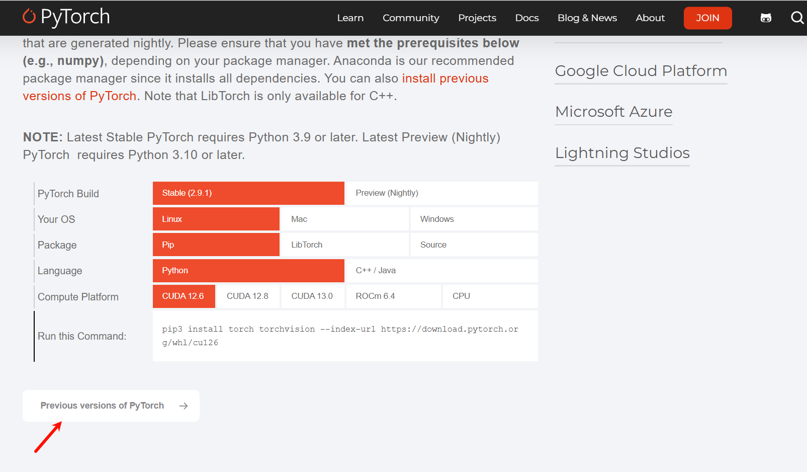

首先查看服务器cuda版本，为12.4

```{bash}
nvidia-smi
```

然后进行[pytorch官网](https://pytorch.org/)，找到对应版本的安装命令




```{bash}
pip install torch==2.6.0 torchvision==0.21.0 torchaudio==2.6.0 --index-url https://download.pytorch.org/whl/cu124
```

检查pytorch是否可用gpu

```{python}
import torch
torch.cuda.is_available()

# 输出true说明安装成功
```