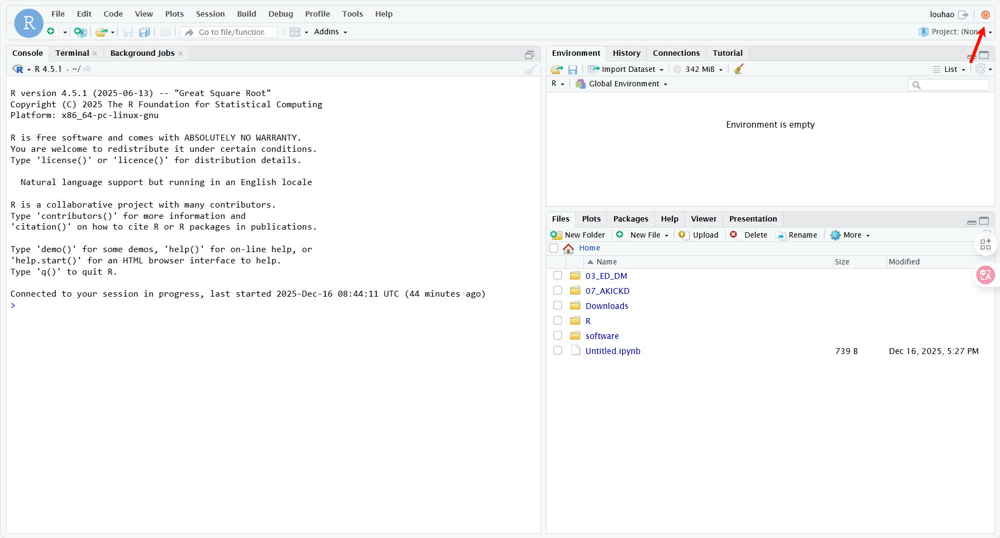
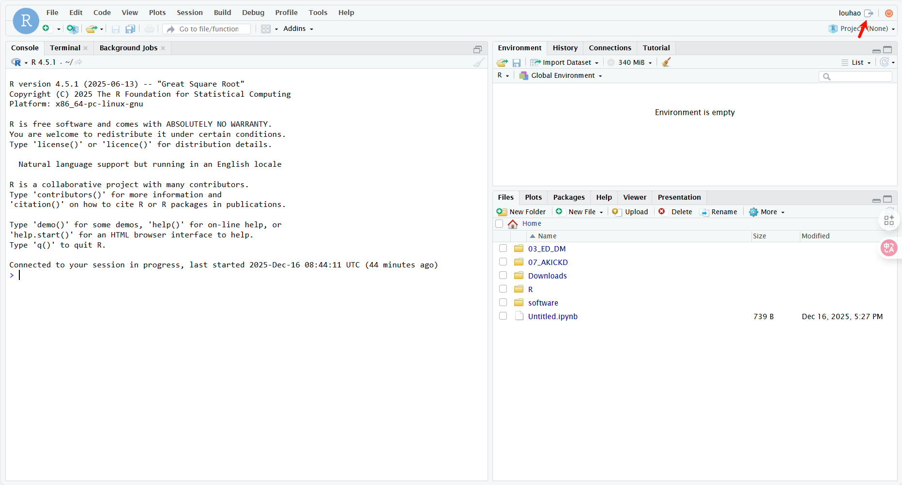
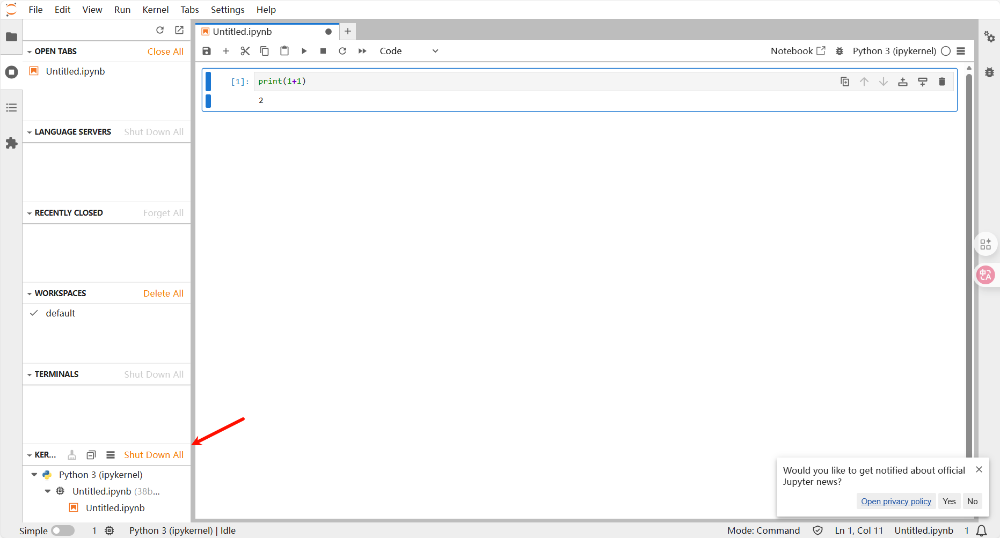
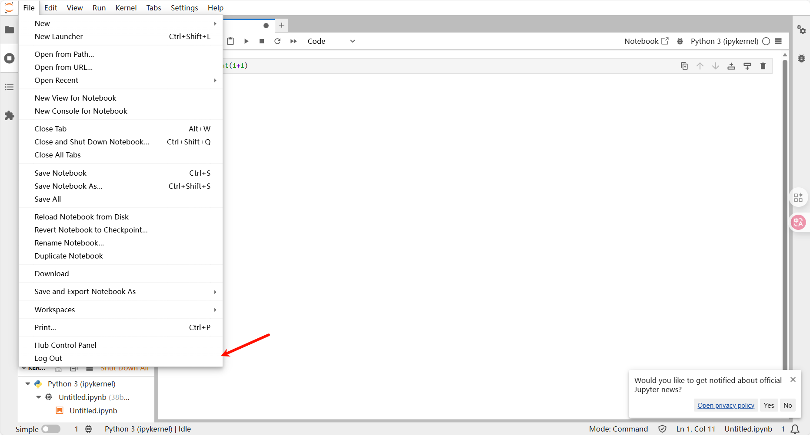

这是一个很多新手（甚至老手）都容易忽略的问题。**直接关闭浏览器标签页 ≠ 退出程序**。

在 VHPC 这种共享服务器上，如果不正确退出，你的后台进程（R 语言引擎或 Python 内核）会一直卡在服务器内存里，**持续占用 CPU/显存**，甚至导致下次登录时报错。

以下是标准的操作姿势：

------------------------------------------------------------------------

### 1. 正确退出 RStudio Server

**❌ 错误做法：** 直接点浏览器右上角的 `×` 关闭网页。 **后果：** R Session 挂起（Suspended），变量全都在内存里。下次进来虽然能恢复（下次也可能进不了，卡住），但如果你是想释放资源给别人用，这样是不行的。

**✅ 正确做法：**

1.  **先保存你的代码/数据**（Ctrl + S）。
2.  **点击电源按钮：** 在 RStudio 界面右上角，你会看到一个橘黄色或红色的**电源图标**（Quit the current R session）。

1.  **注销账号（Sign Out）：** 这一步最重要！点击右上角的用户名，选择 **Sign Out**。
    -   只有点了 Sign Out，RStudio 才会彻底杀掉你的 User 进程。

------------------------------------------------------------------------

### 2. 正确退出 Jupyter Lab / Notebook

Jupyter 的机制更特殊：**关闭网页界面，Kernel（内核）依然在跑**。即使你 Sign Out 了，你刚才运行的 Python 脚本可能还在后台偷偷吃显存。

**❌ 错误做法：** 直接 Sign Out 或者关闭网页。

**✅ 正确做法（两步走）：**

**第一步：关闭内核 (Shutdown Kernels)** 这是最关键的一步！ \* **在 Jupyter Lab 中：** 点击左侧侧边栏的 **"Running Terminals and Kernels"** 图标（就是一个圆圈里有个方块的图标）。 \* 你会看到 "Kernels" 列表下有正在运行的 `Python 3` 等。 \* 点击旁边的 **"SHUT DOWN"** 或 **"X"** 按钮，把它关掉。 \* **或者在菜单栏：** Kernel -\> Shut Down All Kernels。

**第二步：注销登录 (Log Out)** \* 点击界面右上角的 **File -\> Log Out**。 \* 或者点击右上角的 **Hub Control Panel -\> Stop My Server**（如果你用的是 JupyterHub，这一步能彻底释放你的容器资源）。

------------------------------------------------------------------------

### 为什么必须这么做？

-   **释放显存 (GPU Memory)：** 如果你跑深度学习，不 Shut down kernel，哪怕代码跑完了，显存也会被你的进程霸占着（PyTorch 默认不释放显存）。**你的朋友会发现明明没人跑任务，但显存却是满的，根本跑不起来。**
-   **防止卡死：** RStudio 如果长期挂起不退出，偶尔会出现 Session 锁死，下次怎么登都进不去，只能找管理员去后台 kill 进程。